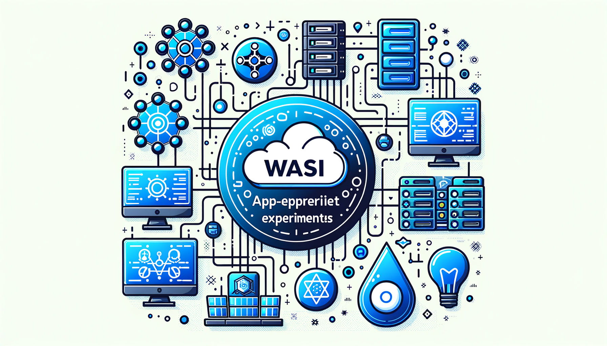
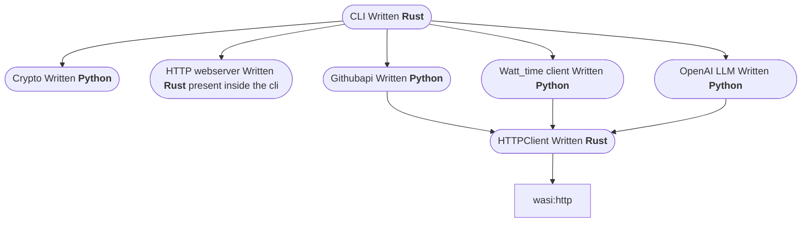

# wae (wasi-app-experiments)



A project which showcases latest development in wasi world. Currently its updated for `wasi@v0.2`. It Helps in accumulate learnings from ML, Green Software and Wasi into a single repo

Why create this?
Becuase this is the main selling point of the wasi to be able to create logic indenendent of the language and highly decoplied ways and with low latency and low footprint (Env Sustabanle ;>). aka benifies of multiple people working in different modules of the program but  at the end all are merged and created a single product

## Skills to be achieved
- use of wasm in real world uscase of FAAS
- python openai,
- rust cli
- watttime api
- python

## How to use it 
```shell
make build
make run_**
```

## Dependency graph



> `httpclient` uses `waki` crate for the http client

`wasihttpclient` uses the `wasi:http` crate for the http client which is actually used by `waki`

## Component descriptions
### CLI 
is the main entry point for the application, it is written in rust and uses the `clap` crate for the command line parsing.

### Crypto
is the module for cryptographic computing, for now its random password generator

### Githubapi
is the module for interacting with the github api, for now its just a simple get request to the github api
- latest release of a public repo
- list contributors of a public repo
- stars and top 10 of them of a public repo

### OpenAI
is the module for interacting with the OpenAI language model
- simple chat bot
- text to image generation as well

### WattTime
is the module for interacting with the WattTime api
- register a free account
- your location and also region code 
- get forcast for 1 hour
- get current Co2 moer index

### HTTPClient
is the module for interacting with the http client, it is written in rust and uses the `waki` which is built on top of `wasi:http` crate for the http client

used by `githubapi`, `watttime` and `openai`

## References & acknowledgements
- @dicej for all the help on how python, rust and build process of the wasi
- @L0RD-ZER0 for the help in implementing in wasi::http::outgoing_handler
