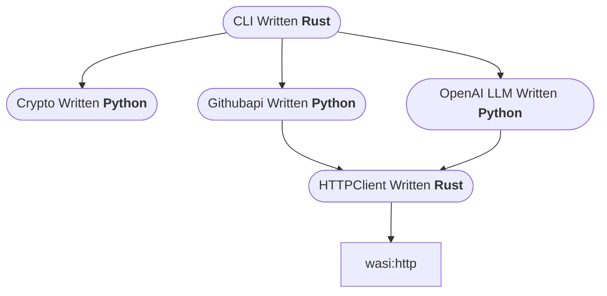

# Automate Using WASM

Why ti create this becuase this is the main selling point of the wasi to be able to create logic indenendent of the language and highly decoplied ways and with low latency and low footprint (Env Sustabanle ;>)

## Skills to be achieved
- use of wasm in real world uscase of FAAS
- python openai,
- rust cli
- watttime api

## Dependency graph

`httpclient` uses `waki` crate for the http client
`wasihttpclient` uses the `wasi:http` crate for the http client which is actually used by `waki`
